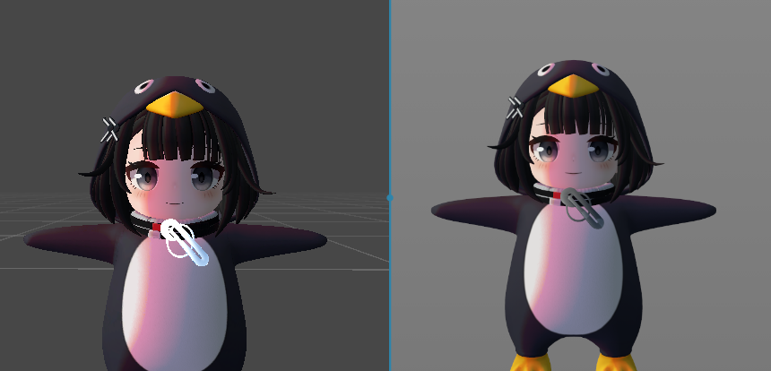
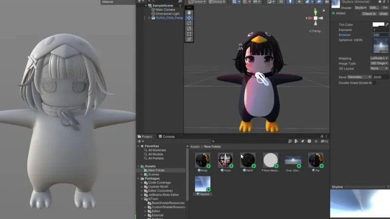
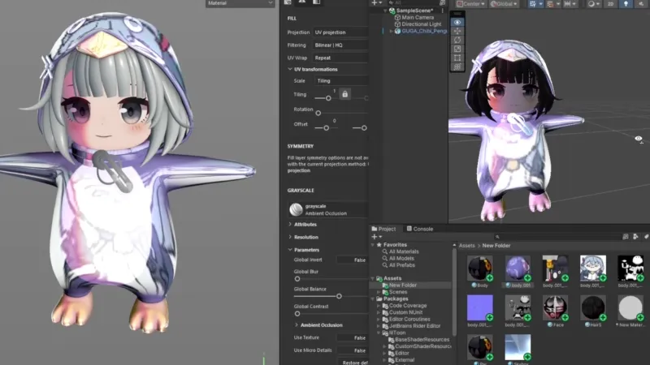

# GrAnit lilToon

| 추천 · 자동 설치 | 직접 폴더에 넣을 거면 |
| :---: | :---: |
| **[⬇️ Releases에서 MSI 받기](https://github.com/GEEAEECODE/Proj_Granit/releases/download/1.1.2/GrAnit-lilToon-1.1.2-x64.msi)** | **[⬇️ Releases에서 ZIP 확인](https://github.com/GEEAEECODE/Proj_Granit/releases/download/1.1.2/GrAnit-lilToon-1.1.2.zip)** |
| 실행 → 설치 | 압축 풀기 → 플러그인 폴더에 복사 |

**작업 저장하고 섭페 끄기 → MSI 설치 → 섭페 켜기 → Python 메뉴에서 `granit_liltoon` 체크.**

ZIP 설치 경로랑 사용법은 아래에 있음. 새 버전은 위의 **[Releases](https://github.com/GEEAEECODE/Proj_Granit/releases/latest)**에서 확인해.

## 🎬 [처음이면 이거부터 — 튜토리얼 영상](https://www.youtube.com/watch?v=W_PbVABDJkw)

처음 쓰면 위 링크 눌러서 영상부터 보면 됨.

---

**Unity lilToon ↔ Substance 3D Painter 대응 셰이더 + 플러그인.**

섭페에서 릴툰 느낌 보면서 칠하고, 유니티랑 머테리얼 설정·텍스처를 주고받으려고 만든 도구임. Unity에서는 기존 lilToon을 쓰고, Painter에서는 GrAnit의 GLSL 셰이더와 Python 플러그인으로 작업하면 됨.



**왼쪽: Unity / 오른쪽: Substance Painter.** 조명·색 관리·렌더링 환경 차이는 있으니 최종 외형은 Unity에서도 확인해.

## 뭐 하는 물건이냐

- **릴툰 대응 프리뷰:** Shadow 1·2·3, Rim Shade, Reflection / Specular, MatCap 1·2 조절.
- **섭페 채널로 작업:** Base Color / Normal / Roughness / Metallic 사용. 그림자 컬러·마스크와 MatCap 마스크도 채널에 칠할 수 있음.
- **텍스처셋별 ON/OFF:** 값은 각각 따로 보관하고, OFF하면 적용 직전 셰이더로 돌아감.
- **Unity → Painter:** `.mat`에서 필요한 설정·텍스처만 골라 가져오기. Material Variant도 부모를 읽어서 가져옴.
- **Painter → Unity:** `.mat` 설정만 저장하거나 머테리얼 + 텍스처로 내보내기. 같은 대상에 다시 내보내면 덮어쓰고 기존 `.meta` GUID는 유지함.
- **머테리얼 바인딩:** `.mat`을 연결하거나 창에 드롭해서 시작. 파일이 없으면 내장 기본값으로 시작할 수 있음. 내보내기 성공 후에는 출력한 `.mat`으로 연결됨.
- **값 관리:** 텍스처셋별 설정·바인딩은 SPP에 저장하고, 마지막 내보내기 경로도 기억함. JSON 프리셋과 값 복사·붙여넣기 UI는 제거했음.
- **다국어 UI:** 상단 콤보박스에서 한국어 / English / 日本語 즉시 전환. 선택한 언어는 이 PC에 기억함. MSI도 한 파일에서 설치 언어를 고르면 됨.

## 일단 설치

**Windows 64비트 / Substance 3D Painter 12용. 확인한 버전은 12.0.3.**

설치나 업데이트 전에 작업 저장하고 섭페 꺼. [Releases](https://github.com/GEEAEECODE/Proj_Granit/releases)에서 **MSI 또는 ZIP 중 하나** 받으면 됨.

- **MSI:** 실행하고 한국어 / English / 日本語 중 언어를 고른 뒤 설치. 문서 폴더 기준으로 플러그인 경로를 알아서 잡음.
- **ZIP:** 압축 풀고 `granit_liltoon` 폴더를 아래 경로에 복사해. 없는 중간 폴더는 만들면 됨.

```text
<문서>\Adobe\Adobe Substance 3D Painter\python\plugins\granit_liltoon
```

문서가 OneDrive나 다른 드라이브로 옮겨져 있으면 실제 문서 폴더를 써. 같은 이름의 폴더를 안에 한 번 더 넣지만 마.

1. Painter 실행 → **Python → granit_liltoon** 체크.
2. 목록에 없으면 **Python → Reload Plugins Folder**로 목록 갱신.
3. **Window → GrAnit-lilToon**에서 플러그인 창 열기.

셰이더는 플러그인에 들어 있음. `머테리얼 ON`을 켜면 프로젝트로 가져와서 적용함. 이미 실행 중인 플러그인의 코드를 다시 읽히려면 Python 메뉴에서 체크를 껐다 켜. `Reload Plugins Folder`는 목록만 갱신함.

## 작업 흐름

창 맨 위에서 언어부터 골라. 아래 영어 기능명도 한국어·일본어 UI에서는 번역돼서 나옴. 셰이더 값과 SPP 데이터는 언어 바꿔도 그대로임.

1. 프로젝트 열고 작업할 텍스처셋 선택 → **mat 바인딩** 또는 `.mat` 드롭 → 가져올 항목 확정. 파일 없으면 **바인딩 없이 시작**.
2. 섭페 레이어에서 칠하고, 플러그인 창에서 셰이더 값 조절.
3. 그림자는 **Use Shadow**, 반사는 **Use Reflection**, 매트캡은 **Use MatCap**부터 켜. Shadow 3은 Alpha가 0이면 안 보이니 쓸 거면 올려.
4. HDRI 반사까지 쓸 거면 **Apply Environment Reflection**도 체크.
5. **SPP 저장.** 텍스처셋별 플러그인 값도 같이 저장됨.

**머테리얼 ON/OFF**는 GrAnit과 적용 직전 셰이더를 전환하는 기능임. **바인딩 해제**는 외부 `.mat` 연결만 끊고, 값·페인팅·셰이더 적용 상태는 그대로 둠. 해제한 뒤에도 값 조절과 새 `.mat` 내보내기는 가능함.

### Unity에서 가져오기

**mat 바인딩 또는 파일 드롭 → 필요한 항목 체크 → 선택 항목 가져오기.** 연결된 파일에서 다시 가져올 때는 **mat 가져오기**를 쓰면 됨.



Unity에서 쓰던 머테리얼을 가져와서 회색 모델에 적용하고, 섭페에서 이어서 작업하는 예시임. 움짤의 좌우 비교 구간은 **왼쪽 Painter / 오른쪽 Unity**. 가져올 설정이랑 텍스처만 골라서 넣으면 됨.

체크박스는 누른 채 드래그해서 여러 개 골라도 됨. 텍스처 적용은 기본 **Fill Layer**, 에셋만 가져오는 방식도 선택할 수 있음. 성공하면 현재 텍스처셋에 lilToon이 자동 적용됨.

연결된 텍스처와 Variant 부모를 찾으려면 원본 Unity 프로젝트와 `.meta` 파일도 필요함. 자동으로 못 찾으면 다이얼로그에서 프로젝트 폴더를 지정해.

### Unity로 내보내기

- **mat 내보내기:** 머테리얼 파일과 텍스처 폴더를 지정해서 함께 저장. 성공하면 내보낸 `.mat`으로 바인딩도 바뀜.
- **mat 퀵 업데이트:** 마지막 성공 경로에 머테리얼과 텍스처를 덮어씀.
- **mat 파라미터 업데이트 / 임포트:** 대상 `.mat`에 설정값만 쓰거나 다시 읽음.



반사색·MatCap 같은 값을 섭페에서 만지고 Unity 쪽 결과를 확인하는 예시임. 좌우 비교 구간은 **왼쪽 Painter / 오른쪽 Unity**. 값만 바꿨으면 **mat 파라미터 업데이트**, 칠한 텍스처도 바뀌었으면 **mat 퀵 업데이트**를 누르면 됨. 내보내기·업데이트 버튼을 눌러 파일에 반영하는 방식임.

릴툰이 설치된 Unity 프로젝트의 `Assets` 아래에 저장하면 연결하기 편함. **같은 이름의 파일 덮어쓰기**를 체크하면 기존 `.mat`과 텍스처를 갱신하고 `.meta` GUID는 유지함. 체크하지 않으면 파일이 겹칠 때 중단함. JSON 동반 파일은 안 만듦. 실패하면 내보내기 창에 이유가 뜨니 설정을 고쳐서 다시 시도하면 됨.

바인딩 없이 시작했을 때는 mat 내보내기만 쓸 수 있고, 성공하면 출력 파일로 연결되어 나머지 버튼도 쓸 수 있음. Variant 원본을 직접 덮어쓰는 건 지원 안 하니 먼저 별도 `.mat`으로 내보내.

## 현재 범위

기준은 **lilToon 2.3.4 / Unity Built-in / Linear**. 현재 머테리얼 교환은 지원되는 **불투명 lilToon** 대상으로 동작함. Variant를 내보낼 때는 최종 값을 가진 독립 `.mat`으로 저장함.

Outline, 전용 헤어·피부 셰이딩, 반투명·굴절은 아직 지원하지 않음. Painter와 Unity의 결과가 완전히 같아지는 건 아니니 위 비교 이미지는 프리뷰 예시로 봐.

업데이트는 Painter 실행 후 플러그인이 처음 시작할 때 한 번 확인하고, 새 버전이 있으면 창 위에 알려줌.

## EULA

[EULA 전문 보기](EULA.png)

## License

Original GrAnit code and documentation owned by GEEAEECODE: **CC0-1.0**. See [LICENSE](LICENSE).

lilToon-derived shader code: **MIT**. See the [upstream copyright and permission notice](plugins/granit_liltoon/shaders/LICENSE.lilToon.txt).

See [NOTICE.txt](NOTICE.txt) for scope and third-party notices. The official English legal texts are preserved without modification. Third-party artwork and assets retain their respective rights.
